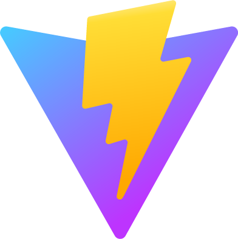

<!-- Icons for badges: https://simpleicons.org -->
<!-- Programming icons: https://devicon.dev --> 

[website]: https://magnusbyrkjeland.no/
[linkedin]: https://www.linkedin.com/in/magnusbyrkjeland/

<!-- https://github.com/kyechan99/capsule-render#how-to-use -->

    
    <!-- -->

For your own safety, get onto the default Github dark mode...🚨

 

### 🌐 Check this out
[][website]
[][linkedin]
<!--  -->

 

### 👀 Languages and Tools I seen before

 
 
<!-- Need the p-tag to get the images aligned... -->

 
 
<!-- Need the p-tag to get the images aligned... -->

<!---->
<!-- -->
<!--  -->

 
 
<!-- Need the p-tag to get the images aligned... -->

 
 

 

### Workspace Setup

  

  

 

<!-- https://github.com/anuraghazra/github-readme-stats -->
## :chart_with_upwards_trend: GitHub Stats

  
  
 

  

